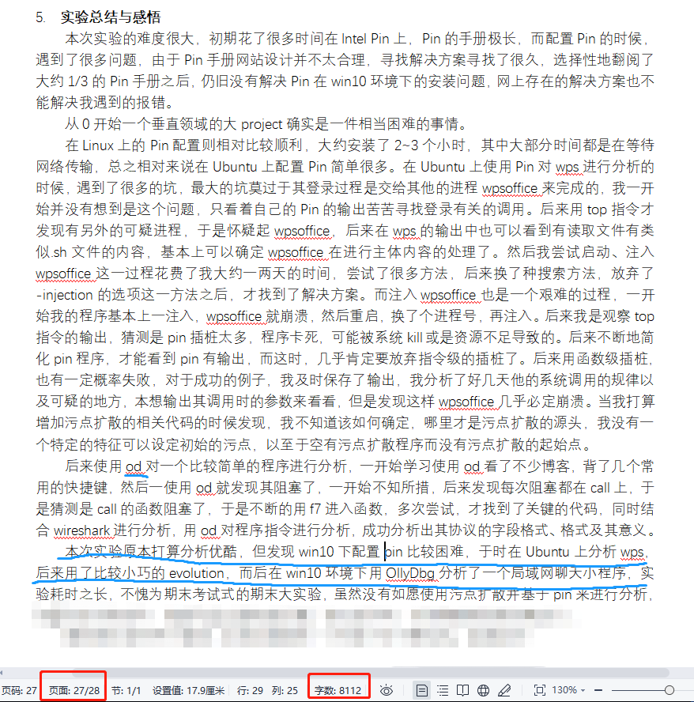
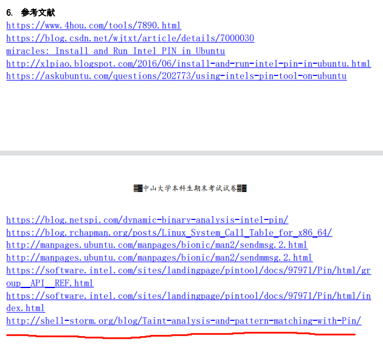

# 期末大作业

> 1. 基于客户端或者服务器端软件执行轨迹的加密网络应用的协议逆向分析
>
> 2. 采用“基于执行轨迹的协议逆向分析方法”对选定的加密应用进行协议逆向分析：
>    a)协议关键词、分界符？
>    b)报文格式？
>    c)字段的语义？例如长度、type、地址等；
>    协议的交互过程（或协议状态机）？
> 3. 写出分析报告：依据的原理、参考的文献、编写的代码、分析的过程、分析过程的截屏、展示结果的图表、关于结果的分析、关于你的逆向分析方法的讨论（特色和不足、与相关工作的对比等）。

参考链接：

-  Intel Pin官网:  https://software.intel.com/content/www/us/en/develop/articles/pin-a-dynamic-binary-instrumentation-tool.html  里面找到User's Manual，很有用，写的很好，就是很长，没必要全部看完。（曾听说有大佬花了两天看完了）
- **Taint analysis and pattern matching with Pin**:   http://shell-storm.org/blog/Taint-analysis-and-pattern-matching-with-Pin/  Intel Pin User's Manual看完必要看的一部分后(约1/3)，可以优先看这个巨佬写的
- 期末考试文档中的最后一个参考链接: https://github.com/zhilongwang/TaintAnalysisWithPin  新repo 没看过

# 关于分数

完成度越高分数越高，按已知信息，往届不乏按要求做完了的。

但是没法完全按要求做完也不用慌，能完成多少就完成多少，期末考试形式的大作业，麻烦拿出与之相配的努力。

期末考试形式的大作业。应该勉强可以推出：大作业不写 = 不参加期末考，大作业不认真 = 期末考试不认真。作业文档给的那么正式，做的工作和交的报告不得与之匹配？ 大作业改分的区分度应该会远大于其他作业。

# 该目录下的一些参考源码

- `github_syscalltest.cpp` 来源不详，应该来自github上某个仓库的。github上使用pin的源码挺多的，但是搜不搜得到适合自己用的，就....
- `Demo_ChapX.cpp ` 总共4个文件，根据源码中的信息，来自博客 http://shell-storm.org/blog/Taint-analysis-with-Pin/ 但实际应来自 http://shell-storm.org/blog/Taint-analysis-and-pattern-matching-with-Pin/  （也就是期末考试文档的倒数第二个参考链接，不确定网站中的源码是否有更新）另外这个巨佬的repo  https://github.com/JonathanSalwan/PinTools 下的TaintAnalysis目录也可以参考。
  - 源码中包含一部分注释，也许对程序理解有一定帮助
- `Demo_Chap5.cpp` 中包含一些污点分析中的核心操作（寄存器级、内存级标记/去标记过程），可以直接拿去用。记忆中这个文件可以过编译，也可以用。问题的核心在于，对于不同应用，要选择一个合适的地方开始做标记。

污点标记起始位置选择：

1. 静态分析：IDA看源码，函数调用，标志性字符串等
2. 动态分析：依据平台选择调试器(ollydbg, gdb)，或者用Pin初步分析

对于小型程序，一般都是两者结合。

# 没什么用的信息

最后挖到一个迟交了很久而且完成度不高的菜鸡报告的实验总结与参考链接，也许能够提供一些帮助。如果觉得没有帮助，就当没看到。





```
6. 参考文献 
https://www.4hou.com/tools/7890.html
https://blog.csdn.net/wjtxt/article/details/7000030 miracles: Install and Run Intel PIN in Ubuntu
http://xlpiao.blogspot.com/2016/06/install-and-run-intel-pin-in-ubuntu.html
https://askubuntu.com/questions/202773/using-intels-pin-tool-on-ubuntu
https://blog.netspi.com/dynamic-binary-analysis-intel-pin/ 
https://blog.rchapman.org/posts/Linux_System_Call_Table_for_x86_64/
http://manpages.ubuntu.com/manpages/bionic/man2/sendmsg.2.html 
http://manpages.ubuntu.com/manpages/bionic/man2/sendmmsg.2.html
https://software.intel.com/sites/landingpage/pintool/docs/97971/Pin/html/group__API__REF.html
https://software.intel.com/sites/landingpage/pintool/docs/97971/Pin/html/index.html 
http://shell-storm.org/blog/Taint-analysis-and-pattern-matching-with-Pin/
```

> 参考链接已经有一部分无法用了，活用google github现学现卖吧，中文的pin参考资料太少了。
>
> 19年给的参考链接里可没有 shell-storm.org 的参考链接，当时是 真·从0开始的Intel pin，有了shell-storm里的教程至少算从0.01开始。找到巨佬写的合适的教程是跳坑的第一步(鬼知道当年这一步花了多少天)
>
> 如果本文档能助你从0.000001开始Intel pin，那就值了。如果没有帮助，那抱歉浪费了你十多分钟浏览这个文档。

# Vmess Share

1. 复制下面vmess开头的内容
2. v2rayN (windows用) 菜单栏：服务器 -> 从剪贴板导入批量URL   或者 ctrl+V：导入 白嫖的vmess节点

```
vmess://ew0KICAidiI6ICIyIiwNCiAgInBzIjogImh0dHBzOi8vZ2l0LmlvL3Y5OTk5IOe+juWbvTU1IiwNCiAgImFkZCI6ICJmcmVlLXJ1c3NpYW4wMS1jZG4ueGlhb2hvdXppLmNsdWIiLA0KICAicG9ydCI6ICI4MCIsDQogICJpZCI6ICIzZDMxNzI4ZS0wNjRkLTQyYjgtYjk0NS1mNzljMDA4ZjczZmMiLA0KICAiYWlkIjogIjIzMyIsDQogICJuZXQiOiAid3MiLA0KICAidHlwZSI6ICJub25lIiwNCiAgImhvc3QiOiAiZnJlZS1ydXNzaWFuMDEtY2RuLnhpYW9ob3V6aS5jbHViIiwNCiAgInBhdGgiOiAiLyIsDQogICJ0bHMiOiAiIg0KfQ==
```

