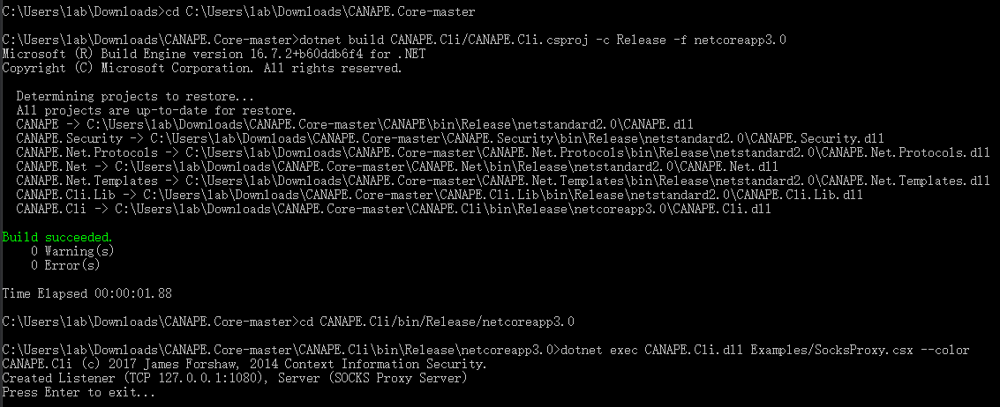
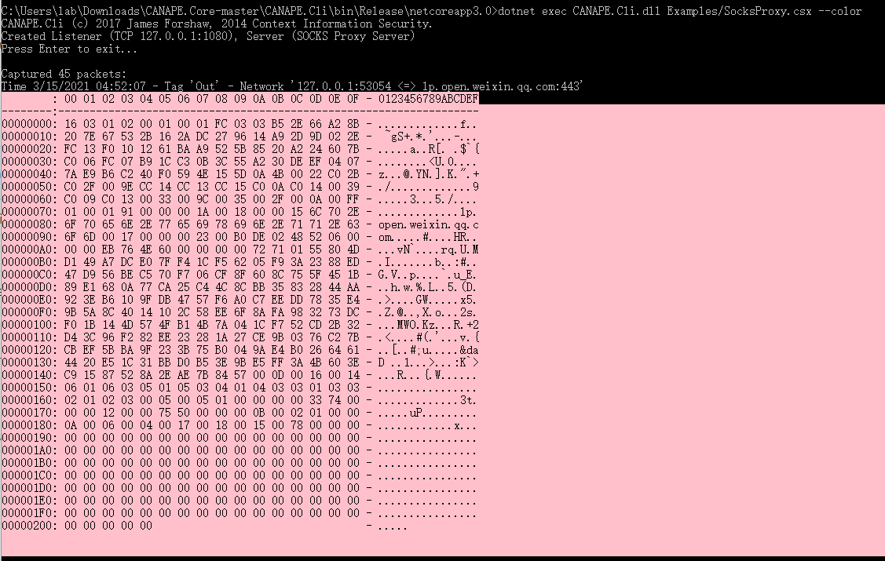

# hw1分数说明

- 文档内要有**姓名学号**
- 本次实验已有部分报告存在**抄袭嫌疑**
- 有部分报告**缺乏实验过程记录**，记录应含
  1. 实验过程、步骤说明
  2. 过程截图
  3. 简要说明截图中的重要信息，或在图中标注重点
  4. 实验遇到的问题与解决过程
- 子实验二：**...并对捕获的前5个数据包进行观察说明**
- 实验中的小亮点小问题不会备注，故会出现备注一样分数不一样的情况
- 报告尽量写的易于阅读些，尽量避免下面两种情况
  1. 过于简洁，无说明无截图
  2. 堆文字堆图片，无重点

> tips: 就算没做出来，记录做出来的部分过程均能拿一定分数。

# 网络协议逆向分析第一次作业

网络协议逆向分析课程（2021）第一次作业辅助材料。本材料由课程TA提供，仅供参考。

## 作业内容：

1. 用strace监控某个应用的系统调用，并对前5条记录进行分析说明；
2. 用Canape Core libraries建一个SOCKS 5 Proxy, 并对捕获的前5个数据包进行观察说明；
3. 用iptables建一个SNAT，并用wireshark捕获数据包，证明你的SNAT建成功了。


## 1. strace

- 用strace监控某个应用的系统调用，并对前5条记录进行分析说明

```bash
sudo apt-get install strace # ubuntu-like Linux
sudo dnf install strace # fedora-like Linux
strace -e trace=network,read,write some_app_process_name
```

- 任务比较简单，分析细致一些就好（反正再细致也没多少字）


## 2. SOCKS 5 Proxy

- 用Canape Core libraries建一个SOCKS 5 Proxy, 并对捕获的前5个数据包进行观察说明

> Canape Core libraries:    https://github.com/tyranid/CANAPE.Core

以下步骤在Win10，无Visual Studio的环境下测试通过，可能需要安装dotnet（安装指引： https://docs.microsoft.com/zh-cn/dotnet/framework/install/on-windows-10）

1. 下载/clone: Canape Core libraries(https://github.com/tyranid/CANAPE.Core), 假设(解压后)文件夹名为`CANAPE.Core-master`
2. cd至`CANAPE.Core-master`，依次执行以下命令（https://github.com/tyranid/CANAPE.Core README.md）：
   1. `dotnet build CANAPE.Cli/CANAPE.Cli.csproj -c Release -f netcoreapp3.0`
   2. `cd CANAPE.Cli/bin/Release/netcoreapp3.0`
   3. `dotnet exec CANAPE.Cli.dll Examples/SocksProxy.csx --color`

> 所使用的源文件为 `CANAPE.Core-master\CANAPE.Cli.Lib\Examples\SocksProxy.csx`

- 至此，SOCKS 5 代理服务已经开启，运行截图：



连接上SOCKS 5代理的方式有很多，课程ppt中以Firefox举例，这里以v2ray为代表举例：

1. v2rayN：菜单栏：服务器：添加Socks服务器
2. 在“编辑或添加Socks服务器”对话框中，填写`SocksProxy.csx`所使用的IP端口号：`127.0.0.1:1080`(上图有显示)
3. 点击确认后选择使用新添加的socks服务器，然后将代理模式更改为全局模式
4. 尝试做联网行为，命令行无新输出，输入回车后会显示抓获的包



- 最基础的操作在这了，有余力的建议对代码进行改动，例如将输出保存为文件（最好是Wireshark可以读取、分析的文件如pcap等）。


## 3. SNAT

> 参考链接： https://blog.csdn.net/zqixiao_09/article/details/53401321


